# PreloadX - Custom Preloader

Customize your WordPress site's preloader with 17 modern CSS loaders, responsive percentage sizing, exit transitions, display rules, and custom background options.

---

Enhance your WordPress site with a fast, modern, and fully customizable preloader experience.

**PreloadX** allows you to seamlessly integrate a lightweight loading screen into your WordPress website. Choose from **17 high-performance, pure-CSS preloader styles**—ranging from classic spinners to futuristic 3D orbits and vector laser loops. Customize the background with solid colors, sleek gradients, or custom images, and tailor the preloader's accent color, size, and typography with real-time live preview.

### 🎨 17 Available Preloader Styles:
1. **Classic Spinner**: Clean, lightweight circular border spinner.
2. **Pulse Ring**: Expanding soft radial pulse ring with fading opacity.
3. **Double Bounce**: Dual harmonic bouncing spheres that scale in counter-phase.
4. **Wave Dots**: Three rhythmic bouncing dots in a smooth sine wave pattern.
5. **Spinning Square**: 3D tumbling geometric square plane with perspective flip.
6. **Rotating Chase**: Sophisticated circular array of orbiting and chasing dots.
7. **Real Progress Bar**: True linear page progress track with live percentage indicator.
8. **Equalizer Wave**: Audio frequency rhythm wave bars pulsing dynamically.
9. **Morphing Fluid Blob**: Organic, shape-shifting fluid liquid blob animation.
10. **Infinity Loop**: Luminous laser tracing a figure-8 path with glowing comet trails.
11. **3D Isometric Cube**: Futuristic 3D tumbling and folding isometric blocks.
12. **3D Celestial Orbit**: Glowing planetary nucleus with three tilted 3D elliptical orbits and orbiting satellites.
13. **Neon Radar Scanner**: High-tech circular radar sweep with range grid and glowing center blip.
14. **Cinematic Text Reveal**: Modern clip-path typography reveal for custom loading phrases.
15. **SVG Outline Drawing**: Dynamic stroke outline mask drawing of uploaded SVG shapes or logos.
16. **Custom Image / Logo**: Pulsing custom brand logo or image.
17. **None (Disabled)**: Turn off the preloader without deactivating the plugin.

### ⚡ Key Features:
- **Responsive Sizing (% and px):** Toggle between **Responsive Percentage (`10% - 200%`)** for automatic scaling across all devices and **Fixed Pixels (`20px - 400px+`)** for exact branding measurements.
- **Corner Radius Control:** Fine-tune corner softness (`0px - 40px`) for square, cube, equalizer, progress bar, and custom image loaders.
- **Typography Scaling:** Direct slider control (`12px - 48px`) over typography sizes for Text Reveal and Progress Bar loaders.
- **Full Color & Background Flexibility:** Support for solid colors, CSS gradients, or full-screen background cover images, with real-time preview.
- **Advanced Display Rules:** Option to **Hide on Mobile** (`wp_is_mobile()`) and **Show Only on Homepage** to keep subsequent subpage navigation instant.
- **Cinematic Exit Animations:** Choose how the loading screen transitions out when the page finishes loading: **Fade Out**, **Slide Up**, **Split**, **Diagonal Wipe**, or **Scale Out**.
- **Minimum Load Time & Fallback Close Button:** Prevent jarring screen flashes on fast connections and provide visitors an emergency dismiss button if external scripts hang.
- **Modern Full-Width Admin Dashboard:** Clean, card-clickable selection interface with live previews and zero radio button clutter.
- **Ultra-Lightweight Performance:** 100% pure CSS animations for GPU acceleration; Vanilla JavaScript with zero jQuery or external CDN dependencies.
- **Compatible with Any WordPress Theme:** Works seamlessly with classic themes, block themes, Elementor, Divi, and other page builders.

## Installation

### Automatic Installation

Automatic installation is the easiest option — WordPress will handle the file transfer, and you won’t need to leave your web browser:
1. Log in to your WordPress dashboard.
2. Navigate to **Plugins > Add New**.
3. In the search field, type **PreloadX - Custom Preloader**, then click **Search Plugins**.
4. Once you find the plugin, click **Install Now**.
5. After installation, click **Activate** to enable the plugin.
6. Configure your preloader under **PreloadX** in the admin sidebar.

### Manual Installation

If you prefer to install manually:
1. Download the `preloadx-custom-preloader.zip` file.
2. Using your preferred FTP application, upload the plugin folder to your WordPress site’s `/wp-content/plugins/` directory (or upload the ZIP via **Plugins > Add New > Upload Plugin**).
3. Activate **PreloadX - Custom Preloader** from the **Plugins** menu.

## Screenshots

### Infinity Loop
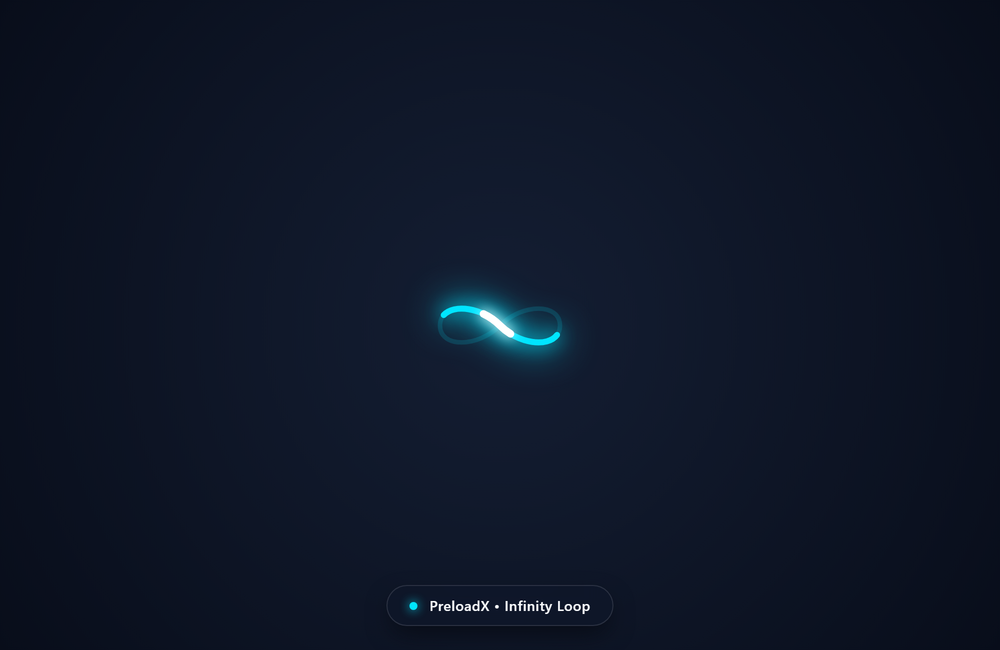

### 3D Celestial Orbit
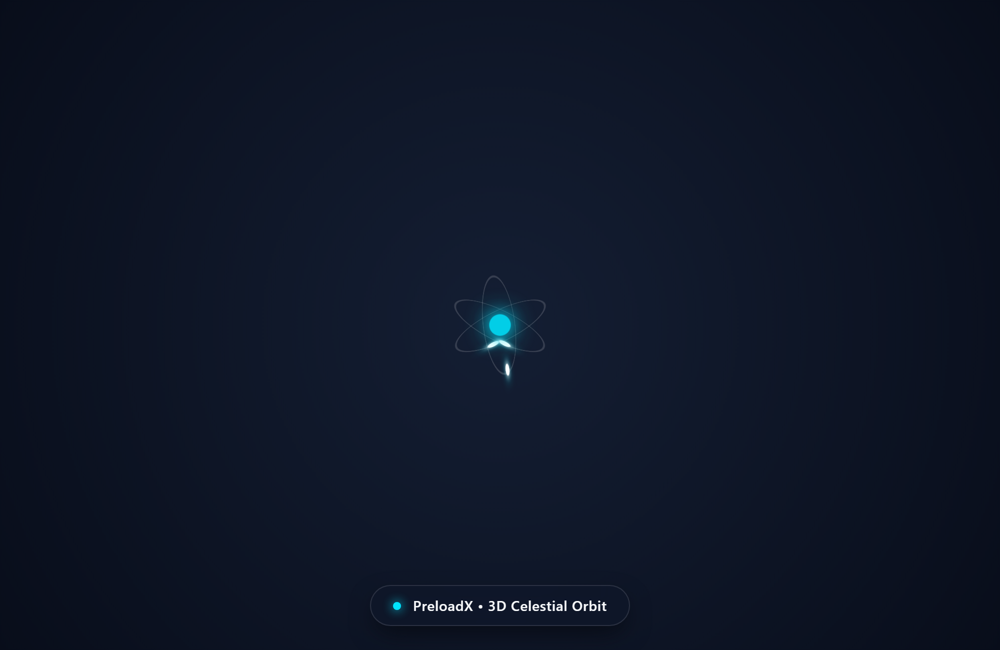

### Neon Radar Scanner
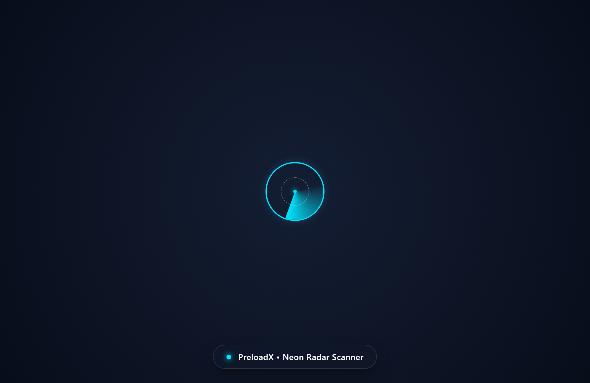

### Real Progress Bar
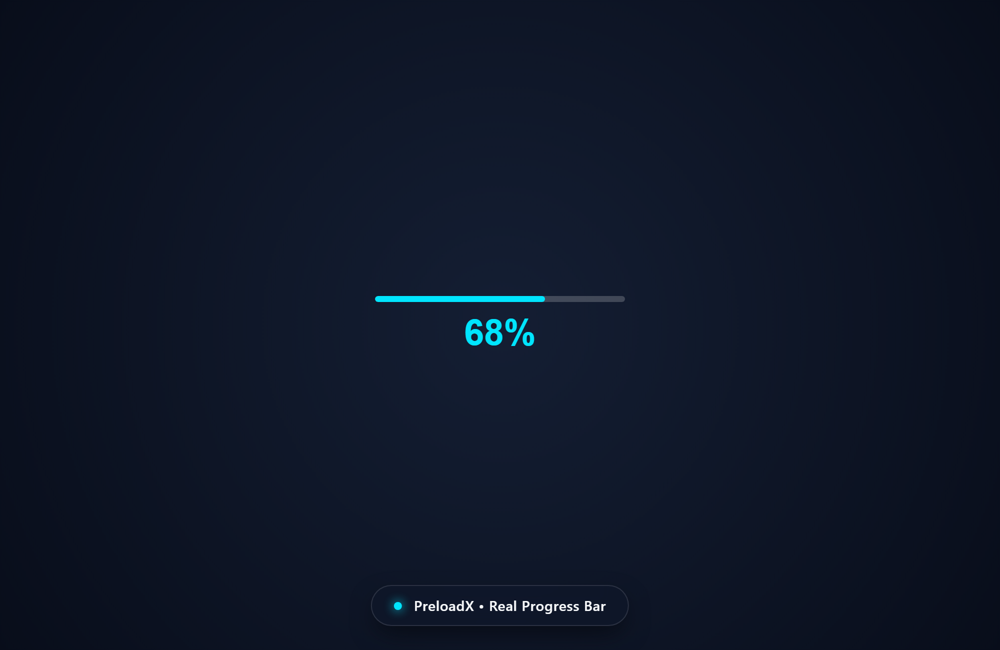

### 3D Isometric Cube
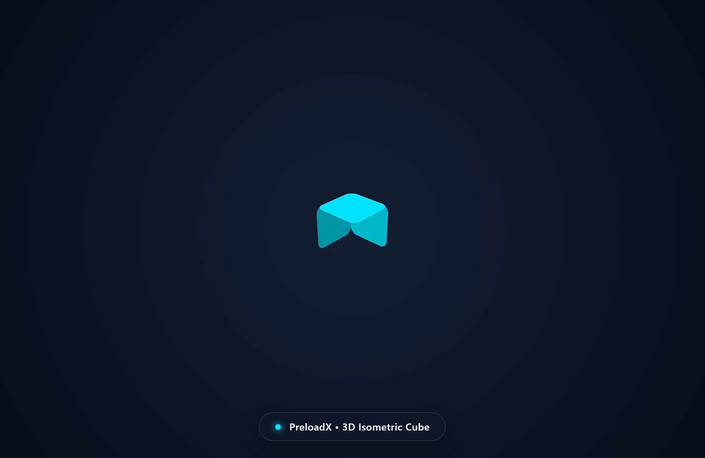

### Equalizer Wave
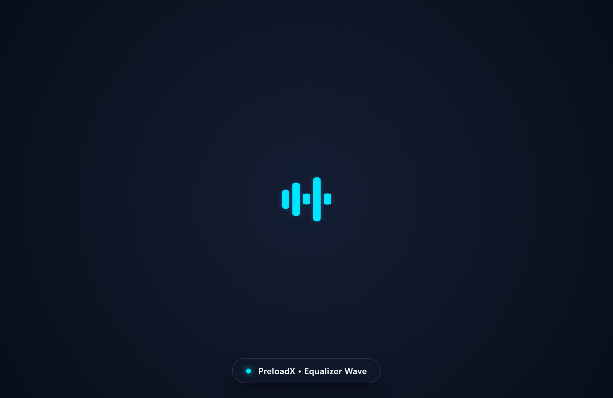

### Morphing Fluid Blob
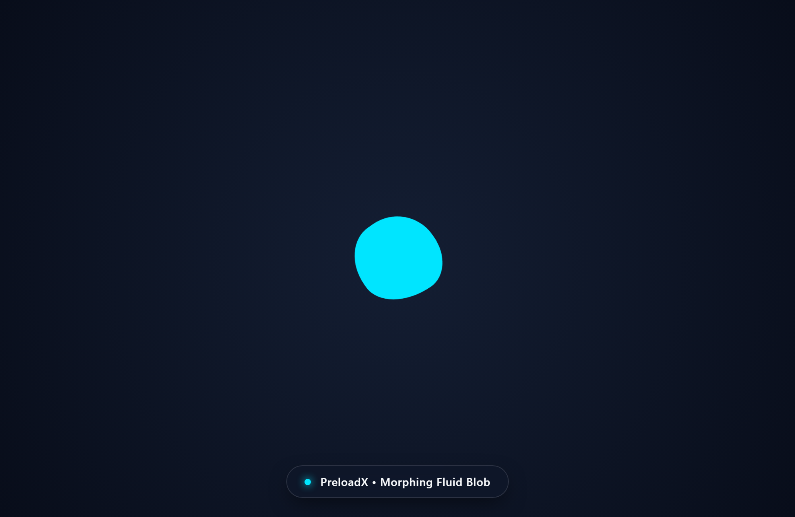

### Classic Spinner
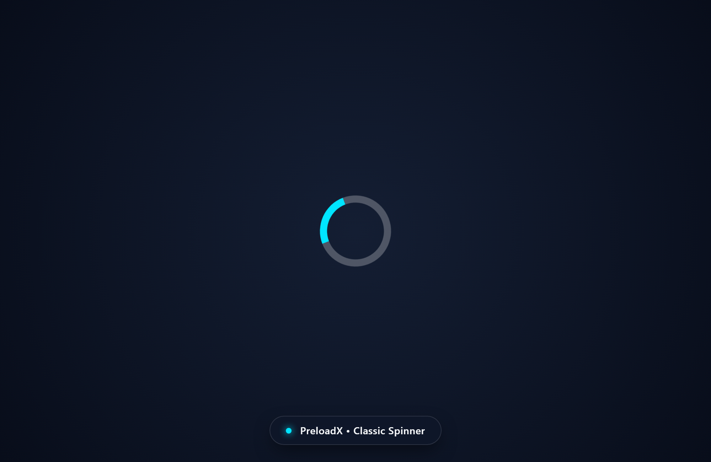

### Pulse Ring

### Double Bounce
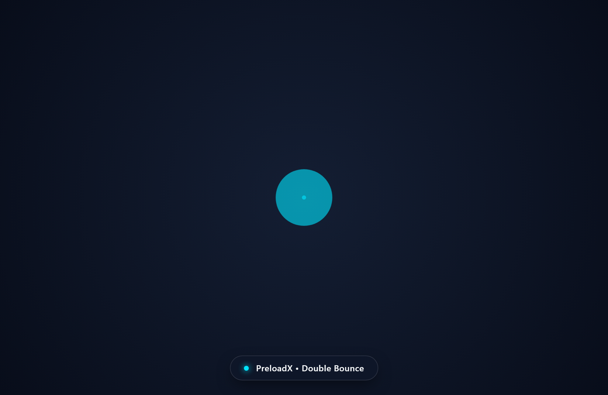

### Wave Dots
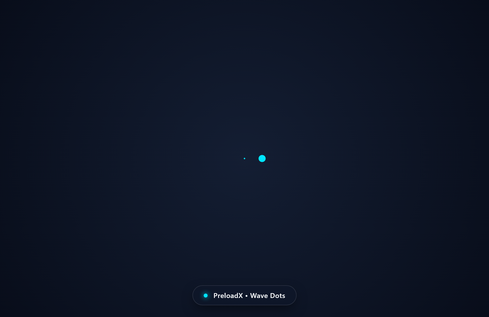

### Spinning Square
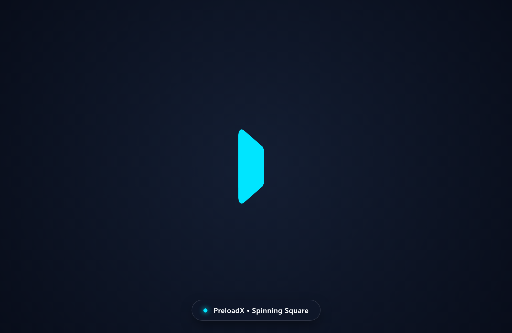

### Rotating Chase
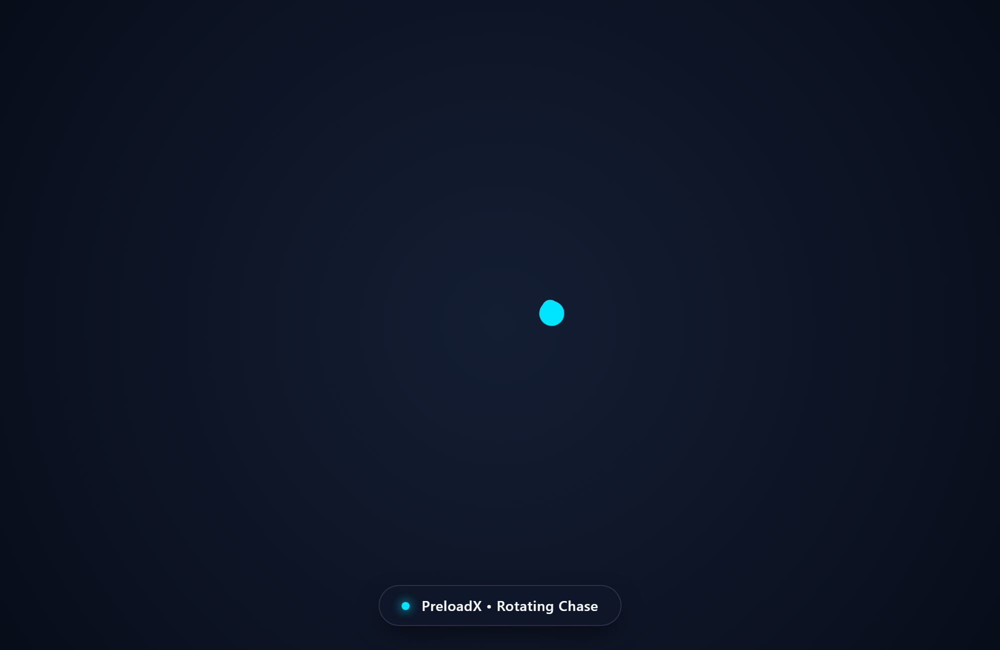

### Cinematic Text Reveal
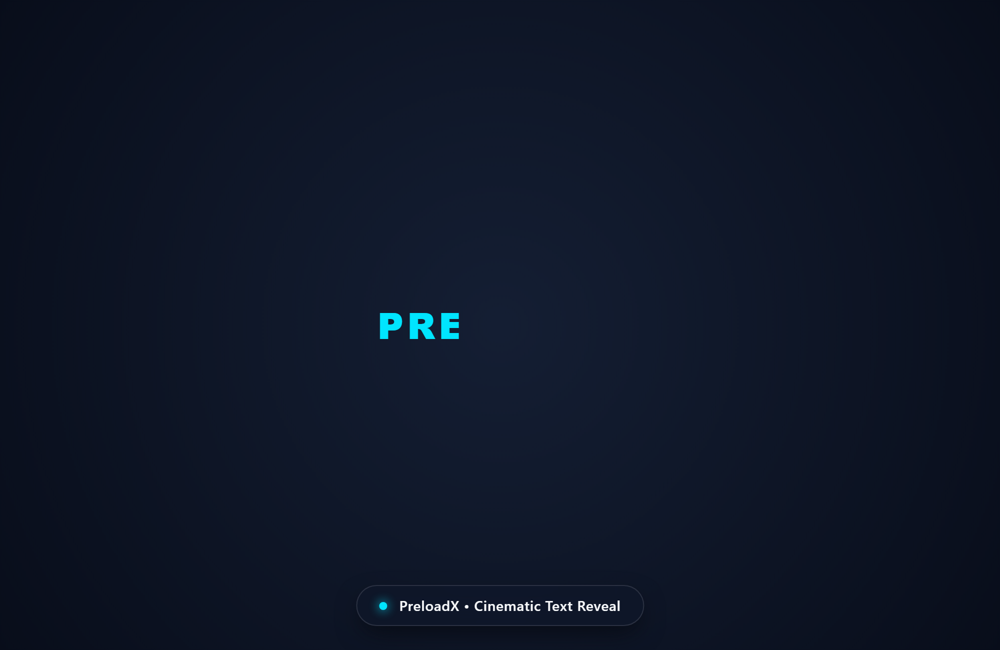

### SVG Outline Drawing
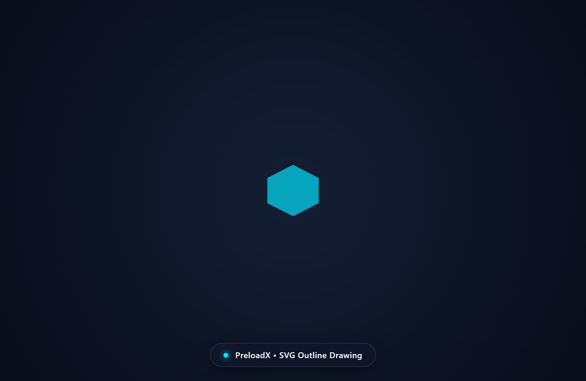

### Custom Image / Logo
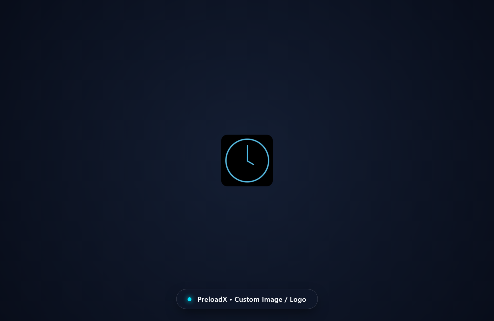

## FAQs

### How do I choose and customize a preloader?
Navigate to **PreloadX** in your WordPress admin menu. Click directly on any of the 17 preloader cards in the gallery to select it, customize dimensions, colors, or background, and click **Save Changes**.

### Can I size the loader in percentages or pixels?
Yes! PreloadX includes an inline **% vs px** unit toggle next to the Loader Size slider. Percentage mode (`10% - 200%`) scales proportionally with the visitor's screen size across mobile and desktop. Pixel mode (`20px - 400px+`) gives you exact pixel precision.

### How do Display Rules work?
Under the **Display Rules & Timing** section:
* Check **Hide on Mobile** to prevent the preloader from rendering on mobile devices.
* Check **Show only on Homepage** to run the preloader only when visitors arrive at your home page, keeping internal subpage navigation instant.

### What are Exit Animations?
When your website completes loading, PreloadX smoothly dismisses the preloader using your chosen exit transition:
* **Fade Out**: Softly dissolves the preloader.
* **Slide Up**: Glides the preloader screen upwards like a theater curtain.
* **Split**: Splits the preloader horizontally from the center.
* **Diagonal Wipe**: Sweeps away at an angle.
* **Scale Out**: Zooms the preloader outward as your content appears.

### What is the Fallback Close Button?
If your website loads third-party external scripts that take unusually long, enabling the **Close Button** provides visitors with an emergency close button in the corner to dismiss the preloader immediately.

### Can I use my company's custom logo?
Yes! Select the **Custom Image / Logo** preloader card, paste the URL of your uploaded image, and adjust corner radius and sizing. PreloadX also includes an **SVG Outline Drawing** preloader that dynamically draws the silhouette of your logo mask.

### Does PreloadX slow down my website?
No. PreloadX is engineered for maximum performance:
* 100% pure CSS animations for GPU-accelerated 60fps rendering.
* Vanilla JavaScript (zero jQuery dependency on the frontend).
* Zero external fonts, CDNs, or third-party script requests.

## Changelog

### 1.1.0
* **NEW:** 17 high-performance pure-CSS preloader animations (Classic Spinner, Pulse Ring, Double Bounce, Wave Dots, Spinning Square, Rotating Chase, Real Progress Bar, Equalizer Wave, Morphing Fluid Blob, Infinity Loop, 3D Isometric Cube, 3D Celestial Orbit, Neon Radar Scanner, Cinematic Text Reveal, SVG Outline Drawing, Custom Image/Logo).
* **NEW:** Responsive Percentage (`%`) vs Fixed Pixels (`px`) Unit Toggle for loader sizing with no upper limit on pixel dimensions.
* **NEW:** Real-time Loader Dimensions & Typography controls (size, corner radius, and font scaling).
* **NEW:** Modern Full-Width Admin Dashboard with clean, card-clickable selection and instant live previews.
* **NEW:** Advanced Display Rules (Hide on Mobile, Show only on Homepage).
* **NEW:** Cinematic Exit Animations (Fade Out, Slide Up, Split, Diagonal Wipe, Scale Out).
* **NEW:** Minimum Load Time & Fallback Close Button options.
* **TWEAK:** Completely refactored frontend to Vanilla JavaScript with zero jQuery or external script dependencies.
* **TWEAK:** Combined General & Appearance with Preloader Gallery into an intuitive unified settings interface.
* **FIX:** Fixed SVG coordinate calculations for smooth continuous Infinity Loop trails on WordPress.
* **FIX:** Fixed circular spinners (Classic Spinner, Radar, Pulse Ring) from distorting at large sizes.
* **FIX:** Fixed frontend asset resolution and CSS rendering on public pages.
* **FIX:** Resolved WordPress Plugin Check (PCP) standards for languages domain path and variable prefixing.

### 1.0.0
* Initial release with 10 Preloaders.
